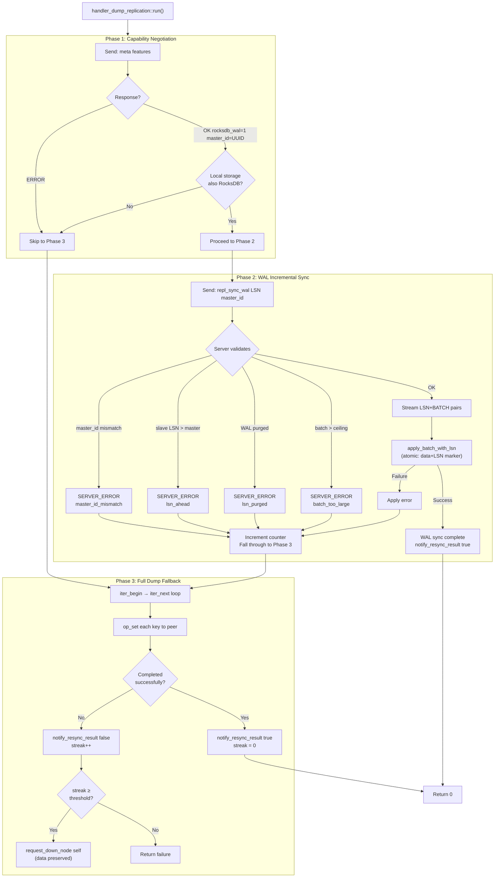
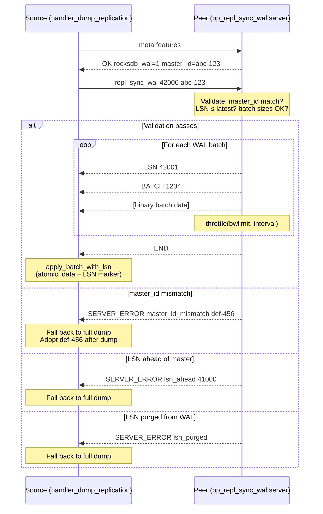
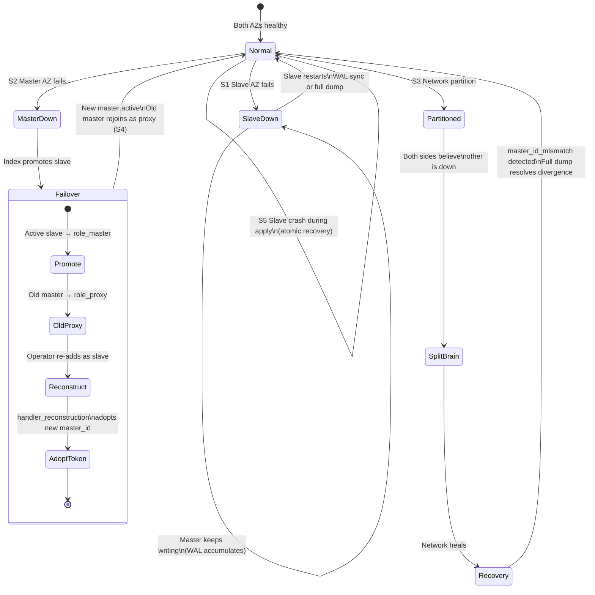
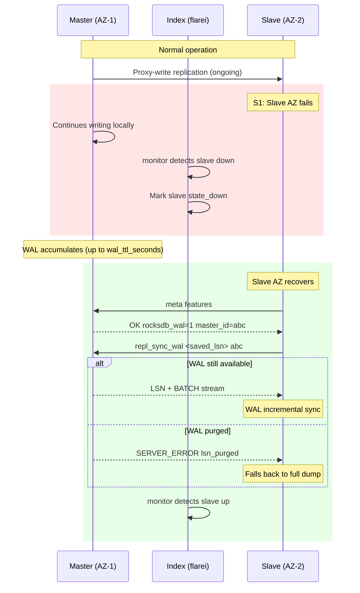
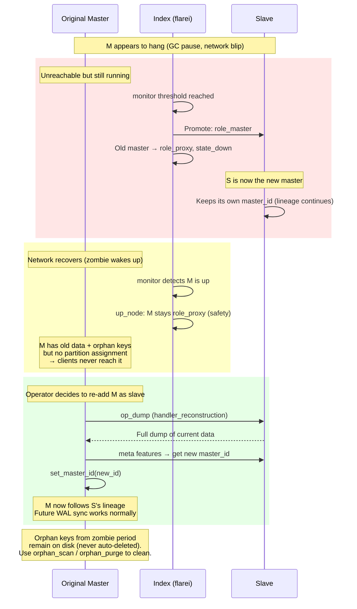
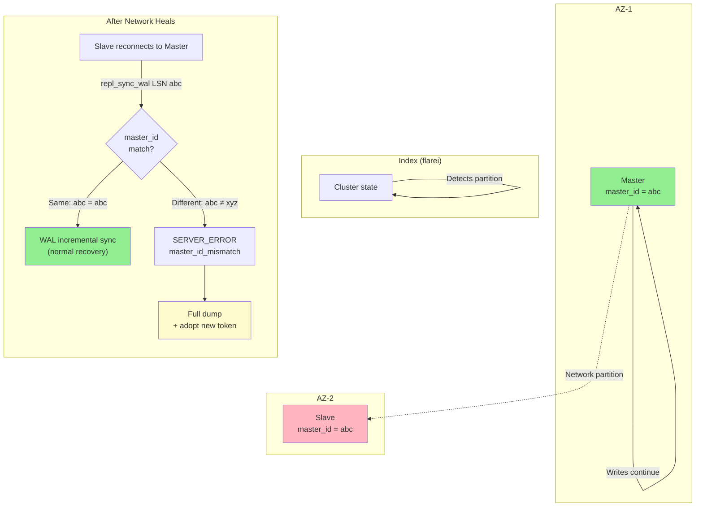
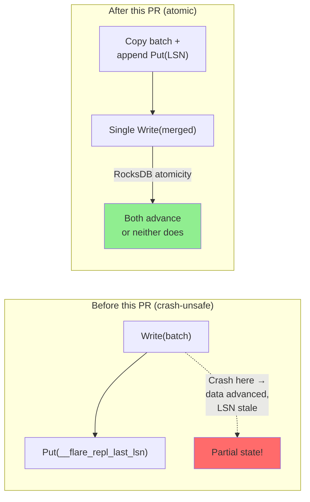
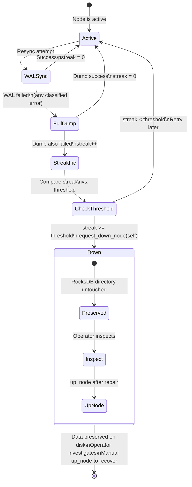
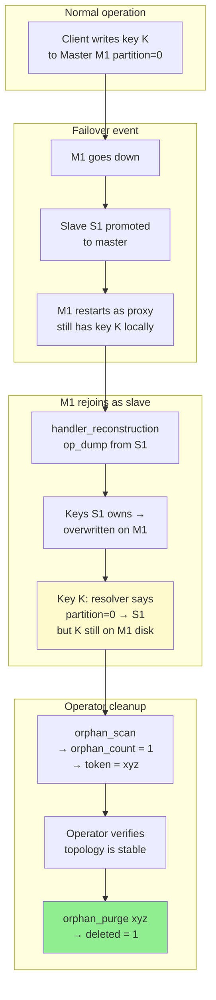
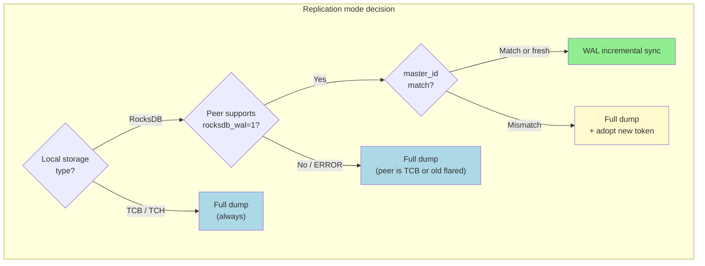

# RocksDB WAL-Based Replication

## Overview

This document describes the Write-Ahead Log (WAL) based incremental replication feature for Flare when using RocksDB as the storage backend. This feature significantly reduces replication overhead by transmitting only the changes since the last successful sync, rather than dumping the entire dataset.

## Architecture

### Key Components

1. **storage_rocksdb**: RocksDB storage backend with WAL access, master
   identity token, reserved metadata key protection, orphan-scan state,
   and observability counters.
2. **op_meta**: Protocol capability and master-identity negotiation
   (extended to return `master_id=<uuid>` alongside `rocksdb_wal=1`).
3. **op_repl_sync_wal**: WAL streaming command with lineage validation,
   LSN-ahead detection, batch-size ceiling, and bandwidth throttling.
4. **handler_dump_replication**: Intelligent replication orchestrator
   that classifies WAL-sync outcomes (success / lsn_purged / lsn_ahead /
   master_id_mismatch / batch_too_large) and falls back to full dump on
   any non-success result.
5. **handler_reconstruction**: Slave-side reconstruction handler that
   adopts the master's identity token after a successful `op_dump`.
6. **op_orphan_scan / op_orphan_purge**: Admin commands for inspecting
   and cleaning up orphan keys left after failover or split-brain events.

### Three-Tier Replication Strategy

The system automatically selects the optimal replication mode:



### WAL Sync Protocol Sequence



## Protocol Details

### Capability Negotiation: `meta features`

**Purpose**: Discover if the peer supports RocksDB WAL replication and
learn its master identity token for lineage tracking.

**Client Request**:
```
meta features\r\n
```

**Server Response (RocksDB enabled)**:
```
OK rocksdb_wal=1 master_id=<uuid>\r\n
```

Older servers that predate the identity-token extension may omit the
`master_id=` token. Clients treat an absent token as "empty" and
behave as a fresh slave on first WAL sync.

**Server Response (RocksDB not available)**:
```
ERROR\r\n
```

**Implementation**: `op_meta.cc`

### WAL Streaming: `repl_sync_wal`

**Purpose**: Stream WAL updates since a given LSN, guarded by a
master-identity token to prevent cross-lineage corruption.

**Client Request**:
```
repl_sync_wal <lsn> <master_id_or_dash>\r\n
```

`<master_id_or_dash>` is the UUID the slave remembers from its last
sync, or `-` (dash) if the slave has no prior lineage.

Example:
```
repl_sync_wal 12345 a1b2c3d4-e5f6-7890-abcd-ef1234567890\r\n
repl_sync_wal 0 -\r\n
```

**Server Response (Success)**:
```
LSN <seq1>\r\n
BATCH <size1>\r\n
<batch_data_1>
\r\n
LSN <seq2>\r\n
BATCH <size2>\r\n
<batch_data_2>
\r\n
...
END\r\n
```

**Server Response (Error — classified)**:
```
SERVER_ERROR lsn_purged\r\n
SERVER_ERROR lsn_ahead <server_latest_lsn>\r\n
SERVER_ERROR master_id_mismatch <server_master_id>\r\n
SERVER_ERROR batch_too_large <batch_size>\r\n
SERVER_ERROR wal_read_error\r\n
SERVER_ERROR not_supported\r\n
```

All error responses cause the caller to fall back to the non-destructive
full-dump path. See the Failure Modes section below for the rationale
behind each classification.

**Implementation**: `op_repl_sync_wal.cc`

### Orphan Key Management: `orphan_scan` / `orphan_purge`

**Purpose**: Inspect and clean up keys that do not belong to this
node's current partition assignment.

**orphan_scan** (read-only, safe to run at any time):
```
orphan_scan\r\n
```
Returns `STAT` lines with `orphan_scan_token`, `orphan_scan_orphan_count`,
`orphan_scan_orphan_bytes`, `orphan_scan_node_map_version`,
`orphan_scan_scanned_keys`, `orphan_scan_partition`, followed by `END`.
The token must be quoted back to `orphan_purge` within 300 seconds.

**orphan_purge** (destructive, requires a valid token):
```
orphan_purge <token>\r\n
```
Returns `STAT orphan_purge_deleted <n>` and `END` on success. Refuses
if the token is expired, mismatched, or if `node_map_version` changed
since the scan.

**Implementation**: `op_orphan_scan.cc`, `op_orphan_purge.cc`

## LSN (Log Sequence Number) Management

### LSN Persistence and Atomicity

The slave stores the last successfully replicated LSN in the reserved key
`__flare_repl_last_lsn`. The LSN update is embedded in the same
`rocksdb::WriteBatch` as the replicated data by `apply_batch_with_lsn()`,
so RocksDB guarantees that either both the data and the marker advance
together, or neither does. This eliminates the crash window that would
exist if the marker were updated in a separate write.

Both `__flare_repl_last_lsn` and the master identity token key
`__flare_repl_master_id` are reserved metadata keys: they are hidden
from `get`, `set`, `remove`, `iter`, `incr`, and `count`, and are
preserved by `truncate` (which resets `__flare_repl_last_lsn` but keeps
`__flare_repl_master_id` for lineage continuity).

### LSN Lifecycle

1. **Initial State**: LSN = 0 (full sync required)
2. **After Sync**: LSN = master's latest sequence number
3. **On Restart**: Read LSN from `__flare_repl_last_lsn` key
4. **Incremental Sync**: Request updates from saved LSN

### WAL Retention Policy

Master retains WAL files based on configuration:

```ini
[data]
# Keep WAL for 24 hours (default)
storage-wal-ttl = 86400

# Limit WAL size to 10GB (default)
storage-wal-size-limit = 10240

# Keep last 1000 log files
storage-wal-keep-log-files = 1000
```

If slave's LSN is older than retained WAL, server returns `lsn_purged` error and slave performs full dump.

## Code Flow (Pseudocode)

### Server Side (handles `repl_sync_wal <lsn> <master_id>`)

```
function _run_server():
    if client_master_id != "" and client_master_id != my_master_id:
        return SERVER_ERROR master_id_mismatch <my_master_id>
    if lsn > my_latest_sequence_number:
        return SERVER_ERROR lsn_ahead <latest>
    updates = get_updates_since(lsn)
    if updates == LSN_PURGED:
        return SERVER_ERROR lsn_purged
    for each (seq, batch) in updates:
        if max_batch_bytes > 0 and batch.size > max_batch_bytes:
            return SERVER_ERROR batch_too_large <size>
        write "LSN <seq>"
        write "BATCH <batch.size>"
        write batch.data
        throttle(bwlimit, interval)
    return END
```

### Client Side (`handler_dump_replication::run()`)

```
function run():
    # Phase 1: Capability negotiation
    (wal_ok, peer_master_id) = meta_features(connection)
    if local_storage is RocksDB and wal_ok:
        # Phase 2: WAL incremental sync
        lsn = local_storage.get_repl_last_lsn()
        mid = local_storage.get_master_id()
        result = repl_sync_wal(lsn, mid)
        if result == success:
            notify_resync_result(true)
            return 0
        # Classify and log the error
        notify_resync_result(false)
        incr_wal_fallback_to_dump()
        # Fall through to Phase 3

    # Phase 3: Full dump (always works, non-destructive)
    iter_begin()
    for each key in iter_next():
        op_set(key, value) to peer
    iter_end()
    notify_resync_result(success_or_failure)
    if should_self_demote():
        request_down_node(self)
    return 0
```

## Performance Characteristics

### WAL Incremental Sync

**Bandwidth**:
- Transmits only mutations since last LSN
- Typical: 1-10% of full dump size
- Compressed WriteBatch format

**Latency**:
- Master: Sequential WAL file read (fast)
- Slave: Sequential batch writes (fast)
- Typical: 10-100x faster than full dump

**Best For**:
- Frequent replication (every minute)
- Large datasets (>100GB)
- High write throughput

### Full Dump Fallback

**Bandwidth**:
- Transmits entire dataset
- Memcached protocol overhead

**Latency**:
- Master: Full DB iteration
- Slave: Individual SET operations
- Typical: Hours for large datasets

**Best For**:
- Initial replication
- After long downtime (LSN purged)
- Small datasets (<1GB)

## Monitoring and Debugging

### Stats Command

When storage type is RocksDB, the memcached `stats` command includes
additional fields. Use these for monitoring dashboards and alerts.

```
STAT rocksdb_master_id a1b2c3d4-e5f6-7890-abcd-ef1234567890
STAT rocksdb_repl_last_lsn 98765
STAT rocksdb_latest_sequence_number 100200
STAT rocksdb_wal_sync_success 42
STAT rocksdb_wal_sync_lsn_purged 1
STAT rocksdb_wal_sync_lsn_ahead 0
STAT rocksdb_wal_sync_master_id_mismatch 0
STAT rocksdb_wal_sync_apply_failure 0
STAT rocksdb_wal_sync_other_error 0
STAT rocksdb_wal_fallback_to_dump 1
STAT rocksdb_resync_failure_count 0
STAT rocksdb_resync_failure_threshold 3
STAT rocksdb_wal_max_batch_bytes 16777216
STAT rocksdb_wal_sync_bwlimit 0
STAT rocksdb_wal_sync_interval 0
```

### Key Metrics and Alerting

| Metric | Steady-state target | Alert if |
|---|---|---|
| `rocksdb_wal_sync_success` | Monotonically increasing | Stops increasing (WAL path no longer used) |
| `rocksdb_wal_fallback_to_dump` | 0 | > 0 (WAL path failed, full dump was used) |
| `rocksdb_wal_sync_lsn_purged` | 0 | > 0 (slave fell too far behind WAL retention) |
| `rocksdb_wal_sync_master_id_mismatch` | 0 | > 0 (lineage divergence detected, investigate!) |
| `rocksdb_wal_sync_lsn_ahead` | 0 | > 0 (slave claims newer LSN than master) |
| `rocksdb_resync_failure_count` | 0 | Approaching threshold (imminent self-demotion) |
| `rocksdb_latest_sequence_number - rocksdb_repl_last_lsn` | Small | > 10000 (slave lagging behind master) |

### Log Messages

**Master side:**
```
[INFO]    streaming N WAL updates from LSN ...
[NOTICE]  master_id mismatch (client=... server=...) -> slave must resync
[WARNING] slave LSN ahead of master latest -> forcing resync
[WARNING] WAL batch at LSN ... exceeds limit -> batch_too_large
```

**Slave side:**
```
[INFO]    attempting WAL replication from LSN ... (master_id=...)
[NOTICE]  WAL replication completed successfully from LSN ...
[WARNING] WAL sync refused (master_id_mismatch) -> full dump
[WARNING] WAL sync refused (lsn_ahead) -> full dump
[NOTICE]  WAL sync refused (lsn_purged) -> full dump
[ERR]     resync failure threshold reached -> self-demoting to state_down
```

## Failure Scenarios (Quick Reference)

Comprehensive analysis including AZ failures, zombie-master resurrection,
split-brain, and data-loss guarantees is in the **Failure Modes,
Consistency, and Operational Safety** section below. A quick reference:

| Scenario | Detection | Recovery |
|---|---|---|
| Slave too far behind (LSN purged) | `lsn_purged` | Full dump (automatic) |
| Slave ahead of master (rollback) | `lsn_ahead` | Full dump (automatic) |
| Different master lineage | `master_id_mismatch` | Full dump + adopt token (automatic) |
| Batch too large for WAL | `batch_too_large` | Full dump (automatic) |
| Slave crash during apply | None needed | Atomic LSN means no partial state |
| Repeated resync failures | Counter crosses threshold | Self-demote to `state_down` (data preserved) |

## Configuration Best Practices

### Minimal RocksDB configuration (all defaults)

```ini
storage-type = rocksdb
```

All `rocksdb-*` options below have sensible defaults; operators only
need to override what their workload demands.

### High-Frequency Replication (< 1 minute interval)

```ini
reconstruction-interval = 30000          # 30 sec between syncs
rocksdb-wal-ttl-seconds = 3600           # 1 hour retention
rocksdb-wal-size-limit-mb = 1024         # 1 GB cap
```

### Low-Frequency Replication (> 5 minutes)

```ini
reconstruction-interval = 300000         # 5 min
rocksdb-wal-ttl-seconds = 86400          # 24 hours
rocksdb-wal-size-limit-mb = 10240        # 10 GB
```

### Memory-Constrained Environments

```ini
rocksdb-block-cache-size-mb = 256
rocksdb-write-buffer-size-mb = 32
rocksdb-wal-size-limit-mb = 512
```

### Strict Durability (single-AZ, no replica for backup)

```ini
rocksdb-sync-writes = true
```

### WAL-Specific Bandwidth Throttling

When the full-dump and WAL-sync phases have different bandwidth
budgets (e.g. daytime WAL vs. nightly bulk dump):

```ini
reconstruction-bwlimit = 10240           # full dump: 10 MB/s
rocksdb-wal-sync-bwlimit = 51200         # WAL sync: 50 MB/s (faster)
rocksdb-wal-sync-interval = 0            # no per-batch delay
```

### Environments with Large Bulk Writes

If the workload includes multi-megabyte single operations (e.g. large
`append`) that could produce huge WriteBatches:

```ini
rocksdb-wal-max-batch-bytes = 67108864   # 64 MB ceiling
```

Setting to 0 disables the check entirely.

## Backward Compatibility

### Legacy Slaves

- Do NOT query `meta features`
- Master does NOT receive `repl_sync_wal` command
- Replication proceeds with traditional full dump
- **No impact on existing deployments**

### Legacy Masters

- Return `ERROR` to `meta features` query
- Slave detects lack of support
- Slave falls back to full dump immediately
- **No impact on existing deployments**

### Mixed Cluster

- RocksDB slaves with Tokyo Cabinet master: Full dump (TCB master
  responds `ERROR` to `meta features`; slave's `master_id` stays
  empty until a RocksDB master is introduced, at which point the
  first WAL sync triggers a one-time full dump + token adoption).
- Tokyo Cabinet slaves with RocksDB master: Full dump (slave storage
  type is not RocksDB, so `use_wal_replication` stays false).
- RocksDB slaves with RocksDB master: WAL incremental sync, with
  automatic full-dump fallback on any lineage/LSN/batch-size mismatch.

## Testing

### Unit Tests (1642 tests, 100% pass rate)

```bash
# Build with RocksDB
./configure --with-rocksdb
make

# Run all RocksDB storage tests (common suite + WAL + Phase A-D)
make check
# or run only the RocksDB tests directly:
cd test
cutter -n "/test_storage_rocksdb/" -s . .
```

The test suite covers:

| Category | Tests | What they verify |
|---|---|---|
| Common storage (GENERATE_*_TESTS) | 1618 | set/get/remove/incr/iter/truncate parity with TCB |
| WAL replication | 5 | LSN monotonicity, incremental sync, deletes, LSN tracking |
| Phase A (core hardening) | 7 | Reserved keys, master_id persistence, atomic LSN, truncate safety |
| Phase B (ops defense) | 4 | Resync failure streak, self-demotion policy, WAL sync counters |
| Phase C (orphan mgmt) | 4 | Token roundtrip, invalidation, consumption, rejection |
| Phase D (perf bounds) | 4 | Default permissiveness, setter roundtrip, batch ceiling reachability |

### Verify WAL Replication in a Running Cluster

```bash
# Check slave's replication state via stats (reserved keys are hidden
# from get, but visible through the stats command):
echo "stats" | nc slave 12121 | grep rocksdb_

# Compare master vs. slave:
# master: rocksdb_latest_sequence_number = 100200
# slave:  rocksdb_repl_last_lsn         = 100200  (caught up)
```

### Orphan Key Inspection

```bash
# Scan for orphans (read-only, safe):
echo "orphan_scan" | nc node 12121
# -> STAT orphan_scan_token <uuid>
# -> STAT orphan_scan_orphan_count 42

# Purge with the token (destructive, requires fresh scan):
echo "orphan_purge <uuid>" | nc node 12121
# -> STAT orphan_purge_deleted 42
```

## Future Enhancements

Items already completed in this PR are marked with a check.

- [x] Metrics endpoint: LSN lag, sync counters, failure streak via `stats`
- [x] Crash-consistent LSN tracking (atomic `WriteBatch`)
- [x] Master identity token for lineage divergence detection
- [x] Resync failure self-demotion with configurable threshold
- [x] Orphan key scan/purge admin commands
- [x] Batch-size ceiling (`rocksdb_wal_max_batch_bytes`)
- [x] WAL-specific bandwidth throttling
- [ ] Compressed WAL transmission: use snappy/lz4 for batch data
- [ ] Parallel batch application: apply multiple batches concurrently
- [ ] Checksum verification: validate batch integrity end-to-end
- [ ] Automatic WAL tuning: adjust retention based on replication lag
- [ ] Background orphan-count estimator for proactive alerting
- [ ] RocksDB Checkpoint-based pre-purge snapshot for rollback safety
- [ ] Correct the WAL sync direction in `handler_dump_replication`
  (currently push-model; should be pull-model for the WAL phase to
  align with the protocol semantics documented above)

## Orphan Key Management

### What Are Orphan Keys?

When a node goes through failover, split-brain recovery, or partition
rebalancing, it may retain keys that no longer belong to its assigned
partition under the current cluster topology. These "orphan keys" are:

- **Invisible to clients**: the key resolver routes reads/writes to
  the partition's current master, so orphans are never served.
- **Harmless but wasteful**: they occupy disk space and slow down
  `count()` and iteration.
- **Never deleted automatically**: the design prioritizes data
  preservation over automated cleanup. An automated purge could
  destroy data during transient topology changes.

### Operational Procedure

1. **Scan** (read-only, safe to run at any time):
   ```
   echo "orphan_scan" | nc <node> <port>
   ```
   Returns `STAT orphan_scan_orphan_count N` and a confirmation token.
   If `orphan_count` is 0, no action is needed.

2. **Verify topology is stable**: confirm that the cluster is not in
   the middle of a rebalance, reconstruction, or failover. Check that
   `node_map_version` has not changed since the scan.

3. **Purge** (destructive, requires fresh token):
   ```
   echo "orphan_purge <token>" | nc <node> <port>
   ```
   The command re-walks the storage and re-evaluates each key against
   the current resolver, so it is safe even if a small number of
   writes occurred between scan and purge. Reserved metadata keys
   (`__flare_repl_*`) are never deleted.

4. **Automation**: if integrated into a cron job or orchestrator, the
   automation **must** verify topology stability between scan and
   purge. The token expires after 300 seconds and is invalidated if
   `node_map_version` changes, providing a built-in safety net.

### When NOT to Purge

- During active reconstruction or rebalancing (topology is in flux).
- Immediately after a failover (wait for the new master to stabilize
  and the old master to rejoin as proxy).
- If `orphan_scan_orphan_count` is unexpectedly large — investigate
  whether the topology is correct before deleting anything.

## Failure Modes, Consistency, and Operational Safety

This section captures the design discussion that shaped the hardening of WAL
incremental replication against real-world failure scenarios: AZ-level
network partitions, node failures, storage-format mismatches between master
and slave, and zombie-master resurrection. Each scenario is analyzed against
two priorities:

1. **Master availability** — the master must keep serving writes.
2. **No total data loss** — under no supported failure mode should a slave
   silently lose all of its data.

### Design Invariants

The WAL replication path is built on top of existing Flare semantics. The
following invariants are relied upon and MUST continue to hold:

- **Full-dump replication is non-destructive.** Neither
  `handler_dump_replication::run()` nor `handler_reconstruction::run()` ever
  calls `storage::truncate()`. Incoming keys are applied via `op_set`, which
  performs a version check and overwrites on a per-key basis. A slave that
  receives a full dump retains any keys that the sender does not mention.
  Consequence: falling back from WAL sync to full dump is always safe; it
  cannot cause total data loss on the slave.
- **`truncate()` is only invoked by `op_flush_all`.** There is no automatic
  code path — replication, reconstruction, monitoring, or recovery — that
  truncates the slave. A slave's RocksDB directory is preserved across every
  automated recovery action.
- **Master writes are local-only on the hot path.** `storage_rocksdb::set` /
  `remove` / `incr` call `_db->Put` / `_db->Delete` / `_db->Write` against
  the master's local RocksDB. Replication to slaves happens via
  `cluster_replication` (proxy-write) and the WAL-sync pull path. Neither
  fails the master's write if a slave is unreachable. Consequence: network
  partitions never stall the master.
- **Atomic LSN tracking.** `apply_batch_with_lsn()` embeds the update of
  `__flare_repl_last_lsn` into the same `rocksdb::WriteBatch` it applies, so
  the slave either advances both the data and the LSN marker together, or
  advances neither. There is no window in which the data has moved forward
  but the marker has not.

### Reserved Metadata Keys

The following keys are reserved by the WAL replication subsystem and are
protected from user-visible operations:

| Key                         | Purpose                                  |
|-----------------------------|------------------------------------------|
| `__flare_repl_last_lsn`     | Last master LSN the slave has applied    |
| `__flare_repl_master_id`    | Identity token of the master this slave  |
|                             | is following (see Master Identity Token) |

These keys:

- Are never returned by `get` / `iter`.
- Are never touched by `set` / `remove` / `flush_all`.
- Are recreated automatically if a `flush_all` or manual wipe removes them,
  so that a wiped slave transitions cleanly to an initial full-dump state.

### Master Identity Token

To detect cross-generation divergence (split-brain recovery, master
rebuilt from scratch, rollback from backup) the master publishes a stable
identity token and the slave remembers which master it is following.

- On first `open()`, `storage_rocksdb` reads `__flare_repl_master_id`. If
  absent, it generates a fresh UUID and persists it. The token is stable
  for the lifetime of the on-disk database and is preserved across slave
  promotion (an ex-slave that becomes master keeps the token it already
  had, so the other slaves see a consistent lineage).
- The slave sends its remembered token alongside the LSN in
  `repl_sync_wal <lsn> <master_id>`.
- The master compares against its own token:
  - **match + `slave_lsn <= master_latest`**: stream incremental updates.
  - **match + `slave_lsn > master_latest`**: the slave is ahead of the
    master (rollback, restore from backup, split-brain remnant). Reply
    `SERVER_ERROR lsn_ahead`. The slave falls back to full dump.
  - **mismatch**: the slave was following a different lineage. Reply
    `SERVER_ERROR master_id_mismatch <master_id>`. The slave falls back
    to full dump and, on completion, adopts the new master's token.
- After any successful WAL sync OR reconstruction, the slave overwrites
  its own `__flare_repl_master_id` with the master's value.

Because the failure reply path always lands on full dump — which is
non-destructive — a mismatch **never** causes data loss; it only forces a
more expensive (but correct) resynchronization.

### Scenario Analysis

Each scenario is labeled with the outcome for (a) master availability and
(b) slave data integrity. "OK" means the scenario is handled correctly by
the design; "mitigated" means it is handled with an additional safeguard
introduced by this PR.

#### Scenario overview (state diagram)



#### S1 & S2: AZ failure and recovery timeline



#### S4: Zombie master resurrection



#### S3: AZ network partition and split-brain resolution



#### Atomic LSN tracking (crash safety)



#### S7: Repeated resync failures → self-demotion



#### Orphan key lifecycle



#### Mixed cluster compatibility matrix



#### S1. Slave AZ down, master alive

- Master: continues accepting writes against local RocksDB. No impact.
- Slave: unreachable; `handler_monitor` eventually marks it `state_down`.
- Recovery: on slave restart within `rocksdb_wal_ttl_seconds`, WAL sync
  catches up incrementally. Beyond the retention window, the slave falls
  back to full dump.
- **Master availability: OK. Data integrity: OK.**

#### S2. Master AZ down, slave alive

- Master: offline. `handler_monitor` on the slave side raises node-down.
- The index (flarei) automatically fails over: an active slave is promoted
  to `role_master`, and the ex-master is demoted to `role_proxy /
  state_down` (`cluster.cc:531-589`).
- The promoted slave keeps its own `__flare_repl_master_id`, which now
  serves as the new lineage token for the rest of the partition.
- **Master availability: OK (after failover). Data integrity: OK.**

#### S3. AZ-level network partition (both sides alive, cannot talk)

- Each side's `handler_monitor` declares the peer down. From each AZ's
  point of view the other AZ is unavailable.
- The master continues writing to its local RocksDB and its own AZ's
  slaves unaffected. WAL accumulates locally; nothing blocks.
- If the partitioned side contains a flarei that decides to promote a
  local slave, both sides may briefly believe they have a master — this
  is a classic split-brain and is **a cluster-management concern, not a
  replication concern**. Flare's existing topology is not designed for
  automatic split-brain resolution; operators are expected to fence one
  side. What this PR guarantees is that **when the partition heals, the
  resulting state is detectable rather than silently corrupt**:
  - If the two sides have diverged (each recorded independent writes),
    the master-identity-token check fires: the reconnecting slave's
    `master_id` no longer matches the surviving master. Response:
    `master_id_mismatch` → full dump → slave adopts the winner's data.
  - If only the master-side progressed (the partitioned "slave" did
    nothing useful), the slave's LSN is stale but consistent. WAL sync
    (or full dump if WAL has rotated) replays the missing interval.
- Losing side's independent writes are discarded. This is the correct
  semantic under "master is authoritative"; the alternative — merging —
  cannot be done safely for memcached-style values.
- **Master availability: OK. Data integrity: OK on the surviving side;
  diverged writes on the fenced side are intentionally dropped.**

#### S4. Zombie-master resurrection (disputed earlier, analyzed below)

This is the case where a master appears down to the index and slaves
long enough to trigger failover, but then reconnects without having
actually crashed. The partition may have been caused by transient
packet loss, a saturated link, or a GC pause that exceeded
`monitor_threshold * monitor_interval`.

**Cluster-level behavior (existing Flare, unchanged by this PR):**

1. `handler_monitor` on the index reaches its threshold and enqueues
   `request_down_node` for the ex-master.
2. `cluster::down_node()` promotes an active slave in the same partition
   to `role_master` (`cluster.cc:562-568`) and demotes the ex-master to
   `role_proxy, node_partition=-1, state_down` (`cluster.cc:584-588`).
3. The topology change is broadcast to the cluster.
4. When the ex-master's connectivity recovers, `handler_monitor` on the
   index observes it up and calls `cluster::up_node()`. At this point
   the resurrected node is still `role_proxy`. The `up_node()` code path
   at `cluster.cc:741-745` explicitly forces:
   ```
   log_notice("node role is set to proxy for safety...", 0);
   n.node_role = role_proxy;
   n.node_partition = -1;
   ```
   This is the key defense: **the zombie never silently rejoins as
   master.** It comes back as a partition-less proxy, carrying its old
   data but having no authority to serve it to clients.
5. Operators (or automation) subsequently decide whether to promote it
   back into the partition as a slave, triggering
   `handler_reconstruction::run()` which runs a full `op_dump` against
   the current master. Reconstruction is non-destructive but authoritative
   for the keys the new master owns.

**WAL replication interaction:**

- `handler_reconstruction` does NOT use `op_repl_sync_wal`; it always
  uses `op_dump`. Therefore the zombie's stale WAL is irrelevant to
  rejoining: it cannot trick another node into replaying a diverged
  history via the WAL path.
- After reconstruction completes, the ex-zombie's
  `__flare_repl_master_id` is updated in-band to match the new master's
  token (by a small hook at the end of `handler_reconstruction::run()`).
  Without this, subsequent `handler_dump_replication` attempts against
  the new master would repeatedly trip `master_id_mismatch` and
  unnecessarily force full dumps.
- The zombie's own local RocksDB may still contain "orphan keys" — keys
  it wrote during the period when it wrongly believed itself to be
  master, that the surviving cluster never saw. These orphans are
  **not** deleted automatically. They are invisible to clients (because
  the key resolver routes reads to the current master for their
  partition), but they remain on disk until an operator runs
  `flush_all` or wipes the directory. This is a deliberate choice: the
  top priority is to avoid total data loss, so leaving orphan data in
  place is always preferred over an automated purge.
- **Master availability: OK (surviving master never stops).**
- **Data integrity: OK on the surviving master. Writes that clients
  believed had succeeded against the zombie during its hallucination
  window are lost** — this is the classical "lost update" problem and
  is unavoidable given Flare's single-master-per-partition model. It
  is a *known* and *bounded* data-loss window, not silent corruption
  of pre-existing data.

#### S5. Slave applies a WAL batch but crashes before updating the LSN marker

- Before this PR: the `apply_batch` `Write()` and the subsequent LSN
  marker `Put()` were two separate RocksDB operations. A crash between
  them left the slave data newer than its recorded LSN. On restart,
  the next WAL sync replayed the same range again. `set` / `remove`
  are idempotent under overwrite, but `incr` is **not**, so values
  could drift.
- After this PR: `apply_batch_with_lsn()` adds the LSN marker `Put` to
  the same `WriteBatch` that carries the replicated operations. RocksDB
  commits the batch atomically. On crash recovery the slave is either
  entirely before or entirely after the batch; never in between.
- **Mitigated by (3) in this PR.**

#### S6. Storage-format mismatch (master TCB, slave RocksDB or vice versa)

- **master=RocksDB, slave=TCB/TCH**: the slave sends `meta features`
  → master answers `rocksdb_wal=1`, but the slave's own storage is
  not RocksDB so `use_wal_replication` remains false
  (`handler_dump_replication.cc:90` guards on the local storage type).
  The cluster falls through to full dump, which is the only sensible
  path because the on-disk formats differ. Master writes continue
  unaffected. **OK.**
- **master=TCB, slave=RocksDB**: the slave queries `meta features`;
  a TCB master replies `ERROR`, so `master_supports_wal` is false and
  the slave takes the full-dump path. The slave's local RocksDB WAL
  still grows (it records every `op_set` received), but with no
  downstream consumer this WAL is pure overhead that is reclaimed
  when `rocksdb_wal_ttl_seconds` elapses. When the operator later
  upgrades the master to RocksDB, the slave's
  `__flare_repl_master_id` is empty (never set by the full-dump path)
  and the new master's token differs → `master_id_mismatch` → one
  more (expected) full dump → subsequent syncs go incremental. **OK.**
- **both TCB**: the WAL code path is compiled in only under
  `HAVE_LIBROCKSDB`; without it, behavior is unchanged from upstream
  Flare. **OK.**

Operational note for TCB → RocksDB master upgrades: expect **exactly one**
full-dump cycle to each slave immediately after the upgrade, as the token
lineage is established. Subsequent replications are incremental. Document
this cost in the migration runbook.

#### S7. Repeated resync failures

If the slave enters a pathological state (disk pressure, persistent I/O
errors, corrupted local DB) where every full-dump attempt also fails,
silently retrying in a loop hides the problem from operators and can
delay human intervention past the point of recovery.

Mitigation (added by this PR, guarded by `#ifdef HAVE_LIBROCKSDB`):

- `storage_rocksdb` tracks a per-process counter
  `_wal_resync_failure_count`.
- After each `handler_dump_replication::run()` attempt (WAL or
  full-dump path), the counter is incremented on failure and reset to
  zero on success.
- When the counter reaches `rocksdb_resync_failure_threshold` (default
  3, configurable via `ini_option`), the slave calls
  `cluster::request_down_node()` against its own address. The index
  demotes it to `state_down`; clients are steered away.
- Crucially, **the slave's RocksDB directory is not touched.** The down
  transition is a pure control-plane event. An operator can inspect
  the data, decide whether to keep, reset, or snapshot it, and then
  manually `up_node` after remediation.
- Exposed via stats: `wal_resync_failure_count`,
  `wal_resync_last_failure_reason`.

#### S8. Host / OS crash

- `_write_options.sync = false` is the default for both TCB and
  RocksDB backends; write durability relies on the OS page cache being
  flushed periodically, so an OS/host crash can lose the last few
  seconds of master writes that were not yet flushed or replicated.
- This matches upstream Flare's existing durability model.
- For deployments that require stricter durability, this PR adds an
  `ini_option` `rocksdb_sync_writes` (default `false`). When set to
  `true`, every `Write()` and `Put()` on the master uses `sync = true`,
  trading throughput for durability. Slaves observe the same setting.
- **Recommendation:** leave as `false` unless the storage tier does
  not provide replication for durability (i.e. single-AZ deployments
  on ephemeral disks). Multi-AZ clusters should rely on replication
  for durability, not fsync.

### Configurable Parameters

All parameters below are added to `ini_option` under the RocksDB group
and are ignored when RocksDB is not compiled in.

| Parameter                              | Default | Purpose                                                            |
|----------------------------------------|---------|--------------------------------------------------------------------|
| `rocksdb_block_cache_size_mb`          | 512     | Block cache size.                                                  |
| `rocksdb_write_buffer_size_mb`         | 64      | Memtable size before flush.                                        |
| `rocksdb_max_write_buffer_number`      | 3       | Number of memtables to keep before stalling.                       |
| `rocksdb_wal_ttl_seconds`              | 86400   | Retention for WAL files used by incremental replication.           |
| `rocksdb_wal_size_limit_mb`            | 10240   | Size cap for retained WAL.                                         |
| `rocksdb_sync_writes`                  | false   | Force `sync=true` on every write for strict durability.            |
| `rocksdb_resync_failure_threshold`     | 3       | Consecutive resync failures before the slave self-demotes to down. |
| `rocksdb_wal_max_batch_bytes`          | 16 MB   | Per-WriteBatch size ceiling for WAL replication. A batch beyond this limit aborts WAL sync with `batch_too_large`, and the caller falls through to the non-destructive full-dump path (which is unaffected by this limit). `0` disables the check. |
| `rocksdb_wal_sync_bwlimit`             | 0       | Bandwidth cap (KB/s) applied to the WAL-sync streaming loop only. `0` inherits the cluster-wide `reconstruction-bwlimit` so existing deployments see no change. |
| `rocksdb_wal_sync_interval`            | 0       | Inter-batch delay (usec) applied to the WAL-sync streaming loop only. `0` inherits the cluster-wide `reconstruction-interval`. |

Operators should tune `rocksdb_wal_ttl_seconds` and
`rocksdb_wal_size_limit_mb` so that the WAL retention comfortably
exceeds the worst-case expected slave downtime; otherwise slaves that
recover late will fall back to full dump.

### Guarantee Summary

Under every supported failure mode this design guarantees:

1. **The master never stops serving writes** because of a replication
   failure. Replication is always a pull initiated from the slave side;
   a failure on the slave, on the network, or during batch application
   cannot block the master's write path.
2. **No automated code path deletes slave data in bulk.** `truncate`
   is only called by `op_flush_all`, an explicit operator action.
3. **Divergence is detected, not hidden.** Master-identity tokens and
   the `lsn_ahead` check prevent silent application of updates from a
   different lineage.
4. **Crash-consistent LSN tracking.** `apply_batch_with_lsn` is atomic
   at the RocksDB level.
5. **Fail-closed under persistent errors.** A slave that cannot
   successfully resynchronize enters `state_down` (preserving its data)
   rather than continuing to serve stale reads.

The one class of loss this design intentionally does not prevent is the
"lost write" window during a zombie-master hallucination (S4): writes
that clients believed they had committed to a master that the rest of
the cluster had already demoted. Preventing this would require
synchronous client-visible acknowledgement against multiple replicas,
which is outside the scope of Flare's async-replication design.

## References

- RocksDB WAL Documentation: https://github.com/facebook/rocksdb/wiki/Write-Ahead-Log
- RocksDB Replication Guide: https://github.com/facebook/rocksdb/wiki/Replication-Helpers
- Flare Protocol Specification: https://github.com/gree/flare/wiki/Protocol

## Authors

- RocksDB Integration: 2026 implementation
- Based on original Flare architecture by GREE, Inc.

## License

GNU General Public License v2.0
