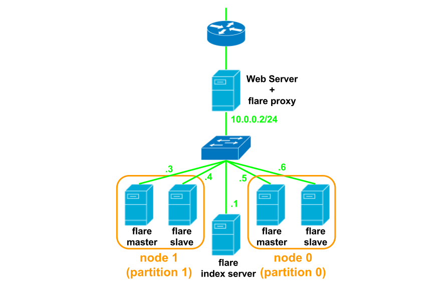

# How To Use

## Node setting
**Normally, use [Flare-tools](https://github.com/gree/flare-tools) to maintain flare by command line.**  


First of all, you should access index server (flarei) by `telnet`.
```
$ telnet [index server] [index server port]
```
After that, you can configure node servers from index server.  
You can check node states like this:
```
stats nodes
```
You can set role to each node server like this:
```
node role [node server name] [node server port] [role=(master|slave|proxy)] [balance] ([partition])
```
You can set status of each node server like this:
```
node state [index server] [index server port] [state=(down|active)]
```
You can remove node server from index server like this:
```
node remove [index server] [index server port]
```

## Store and get keys
Connect proxy, or master node by `telnet`.
```
$ telnet [proxy or master node server] [server port]
```
You can store keys by `set`.
```
set [key name] [index] [index] [word count of key value]
[key value]
```
and you can get keys by `get`.
```
get [key name] [index] [index]
```

## Example
For example, we introduce how to build flare cluster as the figure below indicates:  

- two master node
  - Only master exec write request
- two slave node
  - if master node down, slave became master automatically
  - slave exec read request
- one proxy node
  - proxy divide read request in half for master and slave
- one index server
  - monitor all node
- two partition
  - each partition can install to another location (like region in AWS)

### Create index server
Create config file `/etc/flarei.conf` as below.
```
# data directory
data-dir = /home/flarei
# syslog facility
log-facility = local0
# max-connections to accept
max-connection = 256
# node down threshold
monitor-threshold = 3
# node monitoring interval (index server sends "ping" w/ this interval)
monitor-interval = 1
# server name of myself (IP address is preferred)
server-name = 10.0.0.1
# server port of myself
server-port = 12120
# max thread pool size
thread-pool-size = 8
```
Create data-dir.
```
$ sudo mkdir /home/flarei
```
and start index server.
```
$ sudo /usr/local/bin/flarei -f /etc/flarei.conf --daemonize -p /var/run/flarei.pid
```

### Create master, slave and proxy node
Now, create two master, two slave and one proxy node.  
Create config file `/etc/flared.conf` at each server as below.
```
# data directory
data-dir = /home/flared
# name and port of index server (sync this to "server-name" of flarei.conf at index server)
index-servers = 10.0.0.1:12120
# syslog facility
log-facility = local1
# max-connections to accept
max-connection = 256
# number of lock slots to access records
mutex-slot = 32
# number of proxy request concurrency
proxy-concurrency = 2
# server name of myself (IP address is preferred)
server-name = 10.0.0.5
# server port of myself
server-port = 12121
# storage type (currently only "tch" is available)
storage-type = tch
# storage options
#storage-ap = 4
#storage-bucket-size = 16777216
#storage-compress =
#storage-large = true
# max number of thread pool
thread-pool-size = 16
# stack size of each thread (kb)
#stack-size = 128
```
**In `server-name` setting, we change it at each server in accordance with the above figure.**  
Create data-dir at each server.
```
$ sudo mkdir /home/flared
```
Start flared at each server.
```
$ sudo /usr/local/bin/flared -f /etc/flared.conf --daemonize -p /var/run/flared.pid
```

### Configure node setting
Connect index server by `telnet` as below.
```
$ telnet 10.0.0.1 12120
```
and check node states by `stats` command.
```
stats nodes
```
The result will be printed as below.
```
STAT 10.0.0.2:12121:role proxy
STAT 10.0.0.2:12121:state active
STAT 10.0.0.2:12121:partition -1
STAT 10.0.0.2:12121:balance 0
STAT 10.0.0.2:12121:thread_type 20
STAT 10.0.0.3:12121:role proxy
STAT 10.0.0.3:12121:state active
STAT 10.0.0.3:12121:partition -1
STAT 10.0.0.3:12121:balance 0
STAT 10.0.0.3:12121:thread_type 19
STAT 10.0.0.4:12121:role proxy
STAT 10.0.0.4:12121:state active
STAT 10.0.0.4:12121:partition -1
STAT 10.0.0.4:12121:balance 0
STAT 10.0.0.4:12121:thread_type 18
STAT 10.0.0.5:12121:role proxy
STAT 10.0.0.5:12121:state active
STAT 10.0.0.5:12121:partition -1
STAT 10.0.0.5:12121:balance 0
STAT 10.0.0.5:12121:thread_type 16
STAT 10.0.0.6:12121:role proxy
STAT 10.0.0.6:12121:state active
STAT 10.0.0.6:12121:partition -1
STAT 10.0.0.6:12121:balance 0
STAT 10.0.0.6:12121:thread_type 17
END
```
When you start flared for the first time, all node will treated as proxy.  
So you should give role to each node by `node role` command.
```
node role 10.0.0.5 12121 master 1 0
node role 10.0.0.6 12121 slave 0 0
node role 10.0.0.3 12121 master 1 1
node role 10.0.0.4 12121 slave 0 1
```
and check node states.
```
stats nodes
```
The result:
```
STAT 10.0.0.2:12121:role proxy
STAT 10.0.0.2:12121:state active
STAT 10.0.0.2:12121:partition -1
STAT 10.0.0.2:12121:balance 0
STAT 10.0.0.2:12121:thread_type 20
STAT 10.0.0.3:12121:role master
STAT 10.0.0.3:12121:state active
STAT 10.0.0.3:12121:partition 1
STAT 10.0.0.3:12121:balance 1
STAT 10.0.0.3:12121:thread_type 19
STAT 10.0.0.4:12121:role slave
STAT 10.0.0.4:12121:state active
STAT 10.0.0.4:12121:partition 1
STAT 10.0.0.4:12121:balance 0
STAT 10.0.0.4:12121:thread_type 18
STAT 10.0.0.5:12121:role master
STAT 10.0.0.5:12121:state active
STAT 10.0.0.5:12121:partition 0
STAT 10.0.0.5:12121:balance 1
STAT 10.0.0.5:12121:thread_type 16
STAT 10.0.0.6:12121:role slave
STAT 10.0.0.6:12121:state active
STAT 10.0.0.6:12121:partition 0
STAT 10.0.0.6:12121:balance 0
STAT 10.0.0.6:12121:thread_type 17
END
```
Now, `balance` parametor of slave servers is `0`.  
If this parametor is `0`, no request goes to the node.  
But we want to execute read request on slave server.  
So, we set `balance` parametor to `1`, and devide read requests into halves for master and slave.
```
node role 10.0.0.6 12121 slave 1 0
node role 10.0.0.4 12121 slave 1 1
```
Now, all configuration has been finished.  
Let's use flare.
```
$ telnet 10.0.0.2 12121
```
Set a key for test.
```
set key0 0 0 4
TEST
```
The result:
```
STORED
```
Get a key for test.
```
get key0 0 0
```
The result:
```
VALUE key0 0 4
TEST
```
